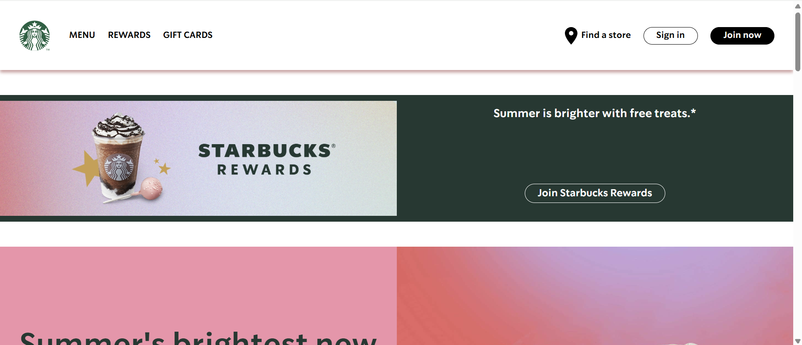

# Home Page Starbucks

## 📖 Description
Ce projet est une réintégration de la page d'accueil de Starbucks en **HTML** et **CSS**. Il s'agit d'une reproduction fidèle de la page d'accueil de la marque, respectant sa mise en page, ses couleurs et son design général.

## 🚀 Technologies utilisées
- **HTML5** : Pour la structure du contenu.
- **CSS3** : Pour le style et la mise en page.

## 🎯 Objectifs
- ✅ Améliorer mes compétences en intégration web (HTML/CSS).
- ✅ Apprendre à reproduire fidèlement une maquette existante.
- ✅ Comprendre l'utilisation des flexbox CSS pour la mise en page.

## ⚡ Installation
```bash
# Clonez ce dépôt sur votre machine locale
git clone https://github.com/leonardo-correiamendes/Starbucks-Home-Page.git

# Ouvrez le fichier index.html dans votre navigateur
open index.html
```

## 📂 Arborescence
```plaintext
├── index.html
├── style.css
└── README.md
```

## 🌐 Aperçu


## 👤 Auteur
- **Leonardo CORREIA MENDES**
- Étudiant en informatique (BUT Informatique)

## ❤️ Remerciements
Merci à Starbucks pour l'inspiration et à Servet Gulnaroglu.
